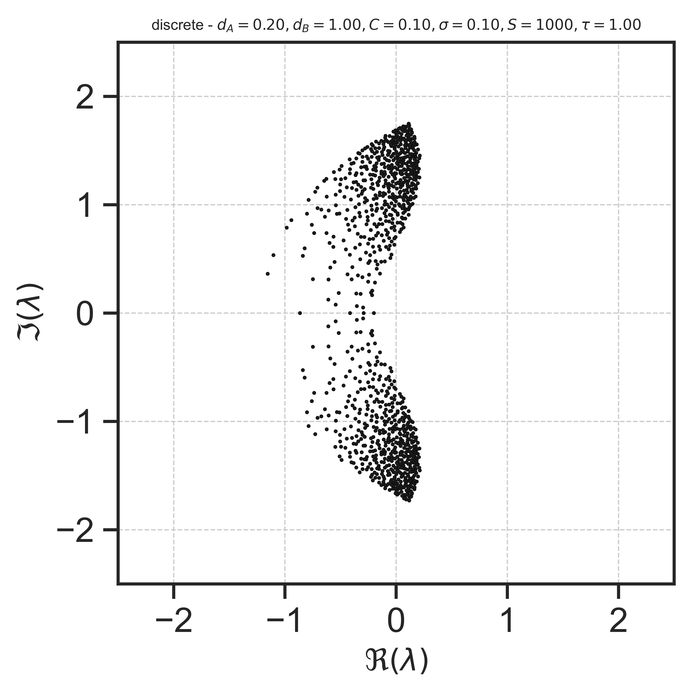

# Delay effects on the stability of large ecosystems
Understanding how communities emerge from a large number of interacting entities is a long-standing question in several fields. In ecosystems with randomly coupled species, a delayed dynamics seemed to play a minor role in characterizing the stability close to equilibrium. Here, we study the effects on large ecosystems of species’ interactions that are random as well as delayed. We find that near equilibrium, delayed self-interactions greatly modify the eigenspectrum distribution as predicted by Wigner’s as well as Girko’s laws. We analytically calculate the ensued generalized laws and identify the geometric profile of the eigenvalues in the complex plane.

In this repository, we provide the Python code for generating the data used in the paper ["Delay effects on the stability of large ecosystems"](https://www.pnas.org/doi/full/10.1073/pnas.2211449119).

## Requirements
The code is written in Python 3.7.4 and requires the following packages:
* numpy
* scipy
* matplotlib
* seaborn

## Usage
The code is organized in the following way:
* `RandomMatrix.py` contains the main functions for generating the random matrices.
* `DelayEffects.ipynb` contains the code for generating a minimal example of the results presented in the paper.

To run the simulations, open the notebook and run the cells.The figures will be saved in the `figures/` folder. Here is an example of the figures generated by the code:


## Citation
If you use this code, please cite the following paper:
```
@article{pigani2022delay,
  title={Delay effects on the stability of large ecosystems},
  author={Pigani, Emanuele and Sgarbossa, Damiano and Suweis, Samir and Maritan, Amos and Azaele, Sandro},
  journal={Proceedings of the National Academy of Sciences},
  volume={119},
  number={45},
  pages={e2211449119},
  year={2022},
  publisher={National Acad Sciences}
}
```

## License
This project is licensed under the MIT License - see the [LICENSE](LICENSE) file for details.

## Acknowledgments
This work was supported by the "Excellence Project 2018” funded by theCariparo Foundation.
